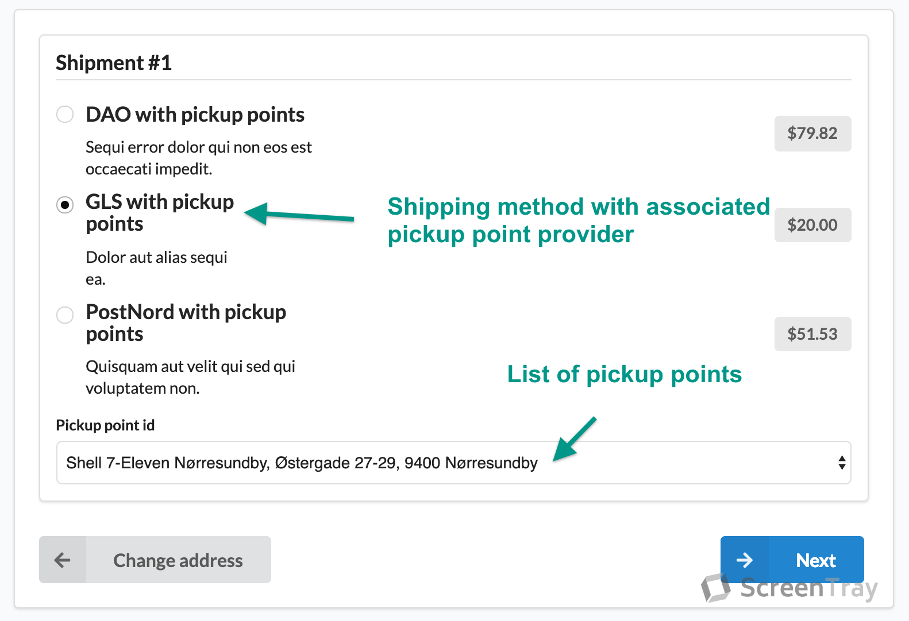
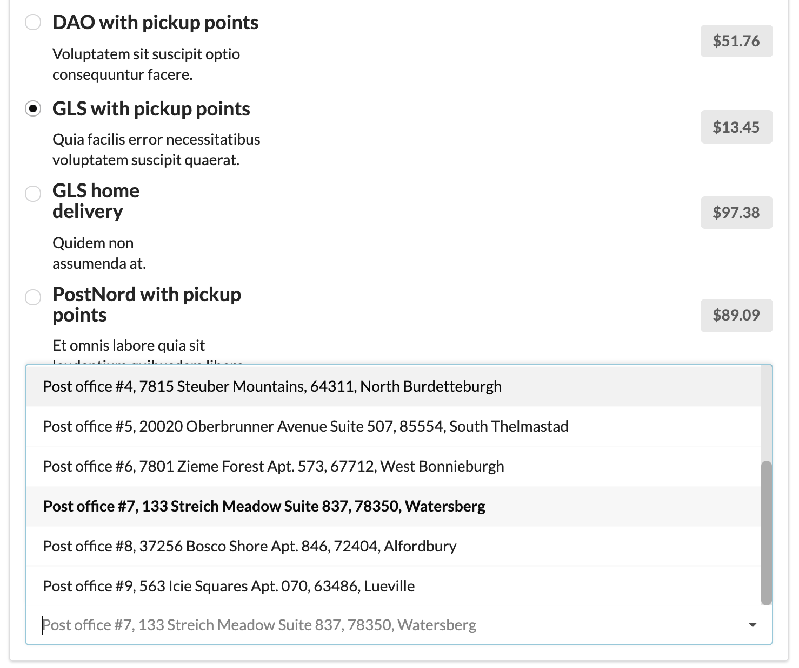
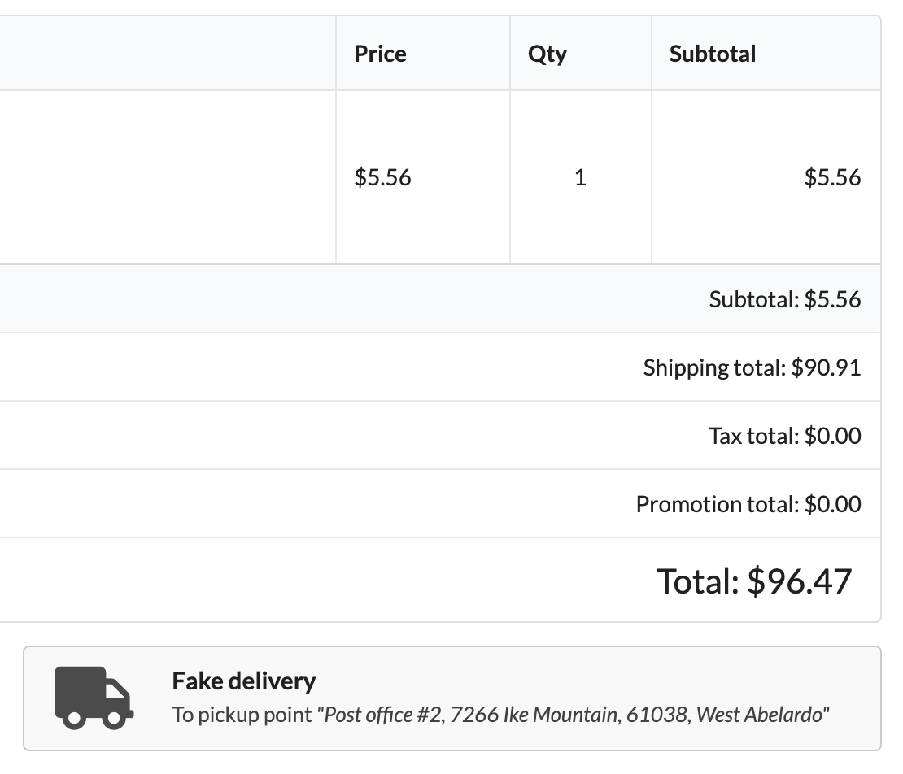
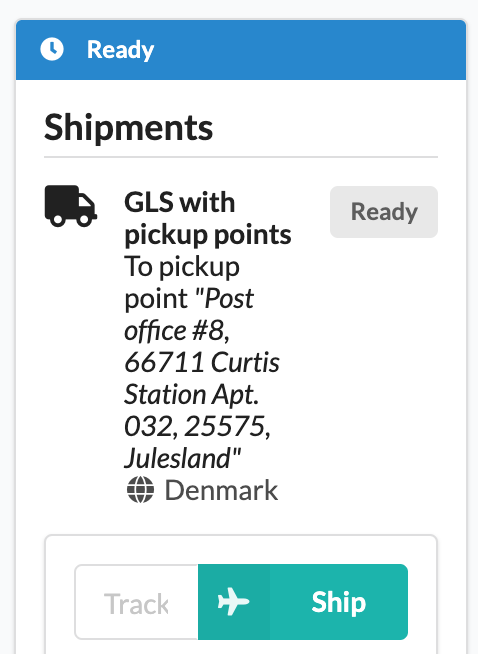
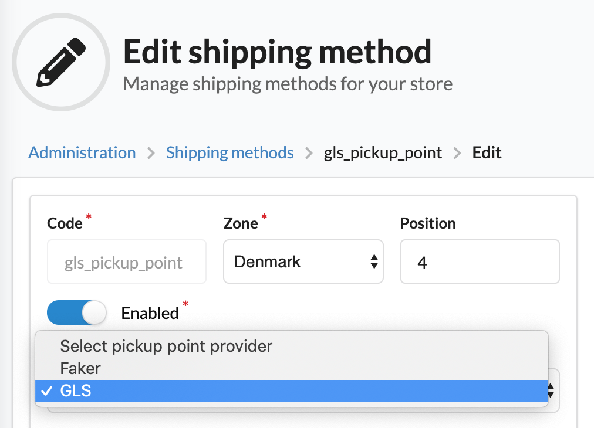

# Sylius Pickup Point Plugin

[![Latest Version][ico-version]][link-packagist]
[![Latest Unstable Version][ico-unstable-version]][link-packagist]
[![Software License][ico-license]](LICENSE)
[![Build Status][ico-travis]][link-travis]
[![Quality Score][ico-code-quality]][link-code-quality]

Add a `<select>` that contains pickup points to your select shipping checkout step.



**Supported providers**
- DAO
  (temporarily partially supported - only with caching enabled, 
  until https://github.com/Setono/SyliusPickupPointPlugin/issues/12 fixed)
- GLS
- PostNord
- Fake provider (for development/playing purposes)

## Screenshots

Shop:





Admin:





## Installation

### Step 1: Install and enable plugin

Open a command console, enter your project directory and execute the following command to download the latest stable version of this plugin:

```bash
$ composer require setono/sylius-pickup-point-plugin
```

This command requires you to have Composer installed globally, as explained in the [installation chapter](https://getcomposer.org/doc/00-intro.md) of the Composer documentation.

Add bundle to your `config/bundles.php`:

```php
<?php
# config/bundles.php

return [
    // ...
    Setono\SyliusPickupPointPlugin\SetonoSyliusPickupPointPlugin::class => ['all' => true],
    // ...
];

```

### Step 2: Import routing and configs

#### Import routing
 
````yaml
# config/routes/setono_sylius_pickup_point_plugin.yaml
setono_sylius_pickup_point_plugin:
    resource: "@SetonoSyliusPickupPointPlugin/Resources/config/routing.yaml"
````

#### Import application config

````yaml
# config/packages/_sylius.yaml
imports:
    - { resource: "@SetonoSyliusPickupPointPlugin/Resources/config/app/config.yaml" }    
````

#### (Optional) Import fixtures to play in your app

````yaml
# config/packages/_sylius.yaml
imports:
    - { resource: "@SetonoSyliusPickupPointPlugin/Resources/config/app/fixtures.yaml" }    
````

### Step 3: Update templates

Add the following to the admin template `SyliusAdminBundle/ShippingMethod/_form.html.twig`

```twig
{{ form_row(form.pickupPointProvider) }}
```

See an example [here](tests/Application/templates/bundles/SyliusAdminBundle/ShippingMethod/_form.html.twig).

Next add the following to the shop template `SyliusShopBundle/Checkout/SelectShipping/_shipment.html.twig`

```twig


{{ form_row(form.pickupPointId) }}
```

See an example [here](tests/Application/templates/bundles/SyliusShopBundle/Checkout/SelectShipping/_shipment.html.twig).

Next add the following to the shop template `SyliusShopBundle/Common/Order/_shipments.html.twig`
after shipment method header:

```twig

```

See an example [here](tests/Application/templates/bundles/SyliusShopBundle/Common/Order/_shipments.html.twig).

Next add the following to the admin template `SyliusAdminBundle/Order/Show/_shipment.html.twig`
after shipment header:

```twig

```

See an example [here](tests/Application/templates/bundles/SyliusAdminBundle/Order/Show/_shipment.html.twig).

### Step 4: Customize resources

**Shipment resource**

If you haven't extended the shipment resource yet, here is what it should look like:

```php
<?php
// src/Entity/Shipment.php

declare(strict_types=1);

namespace App\Entity;

use Doctrine\ORM\Mapping as ORM;
use Setono\SyliusPickupPointPlugin\Model\PickupPointAwareTrait;
use Setono\SyliusPickupPointPlugin\Model\ShipmentInterface;
use Sylius\Component\Core\Model\Shipment as BaseShipment;

/**
 * @ORM\Entity()
 * @ORM\Table(name="sylius_shipment")
 */
class Shipment extends BaseShipment implements ShipmentInterface
{
    use PickupPointAwareTrait;
}
```

**Shipping method resource**

If you haven't extended the shipping method resource yet, here is what it should look like:

```php
<?php
// src/Entity/ShippingMethod.php

declare(strict_types=1);

namespace App\Entity;

use Doctrine\ORM\Mapping as ORM;
use Setono\SyliusPickupPointPlugin\Model\PickupPointProviderAwareTrait;
use Setono\SyliusPickupPointPlugin\Model\ShippingMethodInterface;
use Sylius\Component\Core\Model\ShippingMethod as BaseShippingMethod;

/**
 * @ORM\Entity()
 * @ORM\Table(name="sylius_shipping_method")
 */
class ShippingMethod extends BaseShippingMethod implements ShippingMethodInterface
{
    use PickupPointProviderAwareTrait;
}

```

You can read about extending resources [here](https://docs.sylius.com/en/latest/customization/model.html).

**Update shipping resources config**

Next you need to tell Sylius that you will use your own extended resources:

```yaml
# config/packages/_sylius.yaml

sylius_shipping:
    resources:
        shipment:
            classes:
                model: App\Entity\Shipment
        shipping_method:
            classes:
                model: App\Entity\ShippingMethod
```

### Step 5: Configure plugin

**Enable desired providers**

Note that:
- `faker` provider will not work on prod environment
- `gls` provider require `setono/gls-webservice-bundle` to be installed
- `dao` provider require `setono/dao-bundle` to be installed
- `post_nord` provider require `setono/post-nord-bundle` to be installed

```yaml
# config/packages/setono_sylius_pickup_point.yaml
setono_sylius_pickup_point:
    providers:
        faker: true
        gls: true
        post_nord: true
        dao: true
```

**If you want to use cache**

Cache disabled by default. To enable it, make next configuration:

```yaml
# config/packages/setono_sylius_pickup_point.yaml
framework:
    cache:
        pools:
            setono_sylius_pickup_point.provider_cache_pool:
                adapter: cache.app

setono_sylius_pickup_point:
    cache:
        enabled: true
        pool: setono_sylius_pickup_point.provider_cache_pool
```

### Step 6: Update database schema

```bash
bin/console doctrine:migrations:diff
bin/console doctrine:migrations:migrate 
```

## Troubleshooting

* At `/en_US/checkout/select-shipping` step you see `No results found` at `Pickup point id` field.
  
  Check your browser's developer console and make sure JS scripts loaded correctly.
  Also make sure `setono-pickup-point.js` compiled (read as you not forgot to run `sylius:install:assets`).

[ico-version]: https://poser.pugx.org/setono/sylius-pickup-point-plugin/v/stable
[ico-unstable-version]: https://poser.pugx.org/setono/sylius-pickup-point-plugin/v/unstable
[ico-license]: https://poser.pugx.org/setono/sylius-pickup-point-plugin/license
[ico-travis]: https://travis-ci.com/Setono/SyliusPickupPointPlugin.svg?branch=master
[ico-code-quality]: https://img.shields.io/scrutinizer/g/Setono/SyliusPickupPointPlugin.svg?style=flat-square

[link-packagist]: https://packagist.org/packages/setono/sylius-pickup-point-plugin
[link-travis]: https://travis-ci.com/Setono/SyliusPickupPointPlugin
[link-code-quality]: https://scrutinizer-ci.com/g/Setono/SyliusPickupPointPlugin
