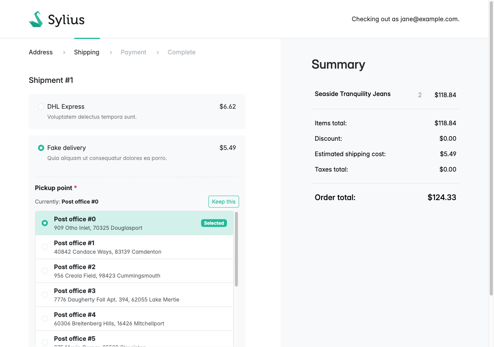
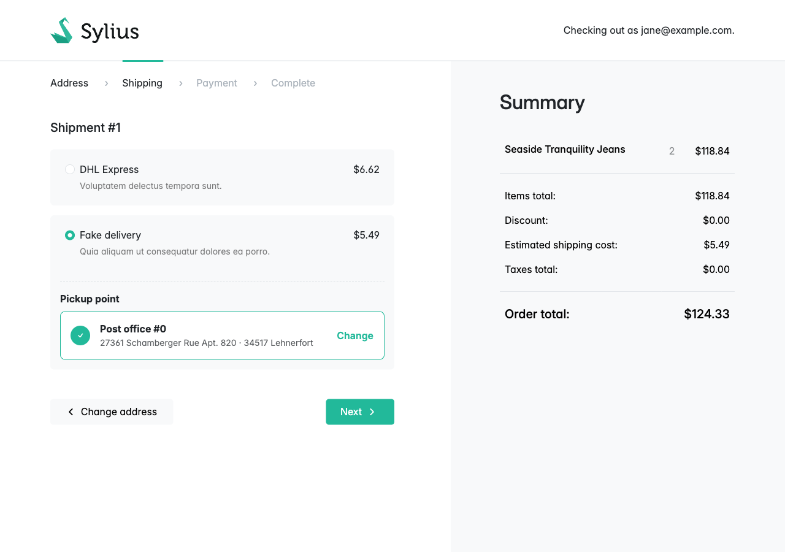
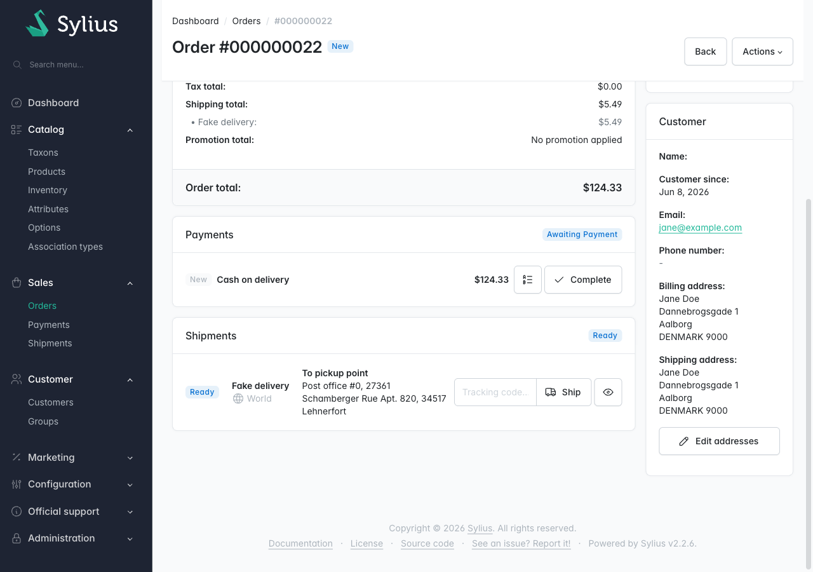
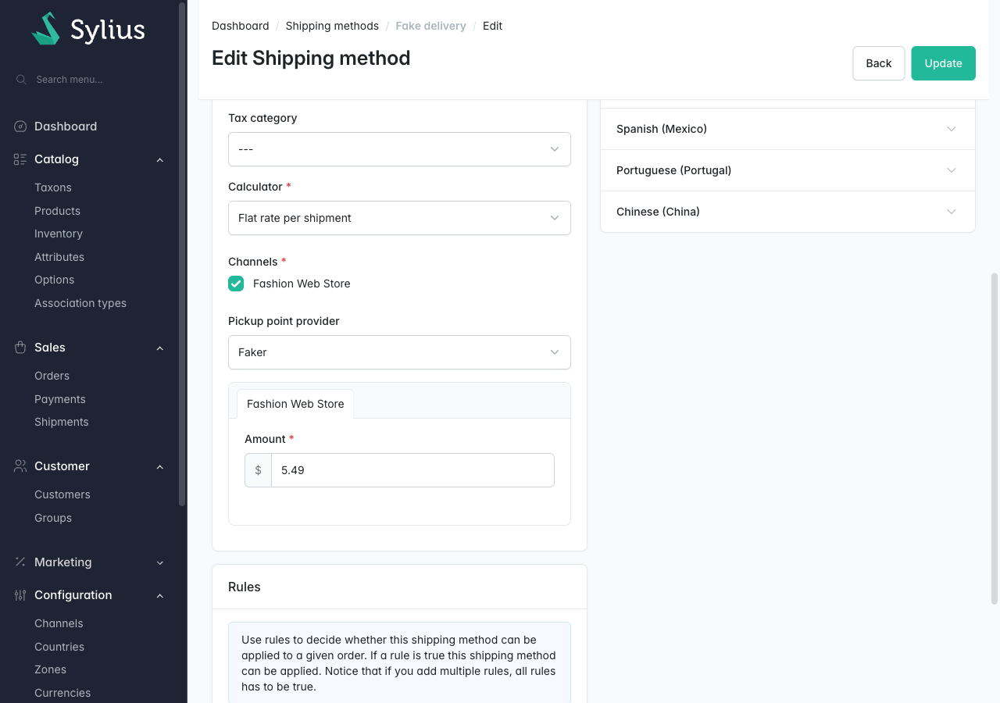

# Sylius Pickup Point Plugin

[![Latest Version][ico-version]][link-packagist]
[![Software License][ico-license]](LICENSE)
[![Build Status][ico-github-actions]][link-github-actions]
[![Code Coverage][ico-codecov]][link-codecov]

Add a pickup-point chooser to your shipping checkout step.

- [Screenshots](#screenshots)
- [Installation](#installation)



**Supported providers**
- DAO
- GLS
- PostNord
- Fake provider (for development/playing purposes — not enabled in `prod`)
- ...or [add your own](#creating-a-custom-provider)

## Compatibility

| Plugin | Sylius        | PHP    | Symfony            |
|--------|---------------|--------|--------------------|
| 2.x    | `^2.0`        | `>=8.2`| `^6.4 \|\| ^7.4`   |
| 1.x    | `^1.0`        | `>=8.1`| `^5.4 \|\| ^6.0`   |

Migrating from 1.x to 2.x: see [UPGRADE.md](UPGRADE.md).

## Screenshots

### Shop

This is the shipping method step in the checkout process where you can choose a pickup point. The points
are loaded asynchronously after the page renders, the nearest one is pre-selected, and the shopper can
expand the list to pick another.



### Admin

On the order you can see what pickup point the customer has chosen.



When you edit shipping method you can associate a pickup point provider to that shipping method.



## Installation

### Step 1: Install and enable plugin

```bash
composer require setono/sylius-pickup-point-plugin
```

Add the bundle to your `config/bundles.php`:

```php
<?php
# config/bundles.php

return [
    // ...
    Setono\SyliusPickupPointPlugin\SetonoSyliusPickupPointPlugin::class => ['all' => true],
    // ...
];
```

### Step 2: Import routing

```yaml
# config/routes/setono_sylius_pickup_point.yaml
setono_sylius_pickup_point:
    resource: "@SetonoSyliusPickupPointPlugin/config/routes.yaml"
```

If your store has [localized URLs disabled](https://docs.sylius.com/en/latest/cookbook/shop/disabling-localised-urls.html),
import `@SetonoSyliusPickupPointPlugin/config/routes_no_locale.yaml` instead.

### Step 3: Customize resources

**Shipment resource**

```php
<?php
// src/Entity/Shipment.php

declare(strict_types=1);

namespace App\Entity;

use Doctrine\ORM\Mapping as ORM;
use Setono\SyliusPickupPointPlugin\Model\PickupPointAwareTrait;
use Setono\SyliusPickupPointPlugin\Model\ShipmentInterface;
use Sylius\Component\Core\Model\Shipment as BaseShipment;

#[ORM\Entity]
#[ORM\Table(name: 'sylius_shipment')]
class Shipment extends BaseShipment implements ShipmentInterface
{
    use PickupPointAwareTrait;
}
```

**Shipping method resource**

```php
<?php
// src/Entity/ShippingMethod.php

declare(strict_types=1);

namespace App\Entity;

use Doctrine\ORM\Mapping as ORM;
use Setono\SyliusPickupPointPlugin\Model\PickupPointProviderAwareTrait;
use Setono\SyliusPickupPointPlugin\Model\ShippingMethodInterface;
use Sylius\Component\Core\Model\ShippingMethod as BaseShippingMethod;

#[ORM\Entity]
#[ORM\Table(name: 'sylius_shipping_method')]
class ShippingMethod extends BaseShippingMethod implements ShippingMethodInterface
{
    use PickupPointProviderAwareTrait;
}
```

You can read about extending resources [here](https://docs.sylius.com/customization/model).

**Update shipping resources config**

```yaml
# config/packages/_sylius.yaml
sylius_shipping:
    resources:
        shipment:
            classes:
                model: App\Entity\Shipment
        shipping_method:
            classes:
                model: App\Entity\ShippingMethod
```

### Step 4: Configure plugin

**Enable desired providers**

- `faker` will not work in the production environment
- Each carrier provider requires its corresponding bundle to be installed:
  - `dao` → `setono/dao-bundle`
  - `gls` → `setono/gls-webservice-bundle`
  - `post_nord` → `setono/post-nord-bundle`

The carrier bundles are listed in this plugin's `suggest` section — install only the ones you need.

```yaml
# config/packages/setono_sylius_pickup_point.yaml
setono_sylius_pickup_point:
    providers:
        faker: true
        gls: true
        post_nord: true
        dao: true
```

### Step 5: Database

```bash
bin/console doctrine:migrations:diff
bin/console doctrine:migrations:migrate
```

### Step 6: Validation groups

Add `checkout_select_shipping` to `sylius.form.type.checkout_select_shipping.validation_groups`:

```yaml
# config/packages/_sylius.yaml
parameters:
    sylius.form.type.checkout_select_shipping.validation_groups: ['sylius', 'checkout_select_shipping']
```

### Step 7: Install assets

```bash
bin/console assets:install
```

The plugin's JavaScript and CSS are auto-included on the shop checkout via Twig
hooks (`sylius_shop.checkout#javascripts` / `sylius_shop.checkout#stylesheets`).
The chooser is a framework-free ES module (loaded with `<script type="module">`)
that builds its UI by cloning overridable Twig `<template>`s, so you can restyle or
extend it without forking — see
[docs/customizing-the-chooser.md](docs/customizing-the-chooser.md).

### Step 8: Admin shipping method form

Add the `pickupPointProvider` field to your admin shipping-method form. With
Sylius 2.x's Twig hooks the cleanest path is a project-local hook config that
points at a template containing `{{ form_row(form.pickupPointProvider) }}`,
attached to `sylius_admin.shipping_method.update.content.form.options` (or a
form section you already render).

## Creating a custom provider

A provider returns the pickup points near an order's address and re-resolves a single point by its id. To add
your own carrier, implement `Setono\SyliusPickupPointPlugin\Provider\ProviderInterface` — or, more simply,
extend the abstract `Setono\SyliusPickupPointPlugin\Provider\Provider`, which already handles the registered
code (`getCode()`), so you only implement two methods.

```php
<?php

declare(strict_types=1);

namespace App\PickupPoint;

use Setono\SyliusPickupPointPlugin\Attribute\AsProvider;
use Setono\SyliusPickupPointPlugin\DTO\Address;
use Setono\SyliusPickupPointPlugin\DTO\PickupPoint;
use Setono\SyliusPickupPointPlugin\Provider\Provider;

#[AsProvider(code: 'acme', name: 'ACME')]
final class AcmeProvider extends Provider
{
    public function __construct(
        private readonly AcmeClient $client, // your carrier's API client
    ) {
    }

    /**
     * @return list<PickupPoint>
     */
    public function findPickupPoints(Address $address): array
    {
        // Every Address field is nullable (the cart may not have a full address yet) — bail when a needed one is missing.
        if (null === $address->postalCode || null === $address->countryCode) {
            return [];
        }

        $points = [];
        foreach ($this->client->search($address->postalCode, $address->countryCode) as $shop) {
            $points[] = $this->transform($shop);
        }

        // Return them ordered by distance from the address: the first one is auto-selected at checkout.
        return $points;
    }

    public function findPickupPoint(string $id, array $metadata = []): ?PickupPoint
    {
        // Called when re-resolving a single point by id; $metadata carries the context you stored (see below).
        $shop = $this->client->get($id, $metadata['country'] ?? null);

        return null === $shop ? null : $this->transform($shop);
    }

    private function transform(object $shop): PickupPoint
    {
        $point = new PickupPoint();
        $point->provider = $this->getCode(); // always stamp the code the provider is registered under
        $point->id = (string) $shop->id;     // unique within this provider
        $point->name = $shop->name;
        $point->address = $shop->street;
        $point->zipCode = $shop->zip;
        $point->city = $shop->city;
        $point->country = $shop->countryCode;
        $point->latitude = (string) $shop->lat;
        $point->longitude = (string) $shop->lng;

        return $point;
    }
}
```

**Register it.** With Symfony autoconfiguration on (the default), the `#[AsProvider(code, name)]` attribute is all
you need — the plugin turns it into the `setono_sylius_pickup_point.provider` tag and the compiler pass does the
rest. Without autoconfiguration, tag the service yourself:

```yaml
# config/services.yaml
services:
    App\PickupPoint\AcmeProvider:
        tags:
            - { name: 'setono_sylius_pickup_point.provider', code: 'acme', name: 'ACME' }
```

The `code` is the machine identifier (registry key, the value stored on the shipping method, and the `provider`
part of the pickup-point token); `name` is the carrier's brand name shown to merchants in the admin form.

**Use it.** A custom provider is just a registered service — it does **not** go in the `setono_sylius_pickup_point.providers`
config (that toggle is only for the plugin's bundled optional providers). To put it to work, edit a shipping
method in the admin and set its **Pickup point provider** to yours (`ACME`); its points are then fetched live at
that method's checkout.

**Good to know:**

- Providers are called **live and lazily** — construction is deferred until the provider is first used, and the
  `/pickup-points` endpoint wraps each provider in its own `try/catch`, so a slow or throwing carrier degrades
  gracefully instead of blocking checkout.
- The submitted token is the whole `PickupPoint`, decoded straight back on submit — `findPickupPoint()` is only
  for re-resolving a point from a bare id/metadata. Put any extra context your API needs to do that into
  `PickupPoint::$metadata` (it round-trips inside the identifier); the well-known `country` is folded in for you.
- Build an `Address` from an order with `Address::fromOrder($order)` when calling a provider outside checkout.

## Play

To see the pickup points list, use the following example address at checkout:

```
Dannebrogsgade 1
9000 Aalborg
DK
```

```
Hämeentie 1
00350 Helsinki
FI
```

```
Vasterhaninge 1
137 94 Stockholm
SE
```

Providers have pickup points in the following countries:

- **DAO**: DK
- **PostNord**: DK, SE, FI
- **GLS**: See https://gls-group.eu/EU/en/depot-parcelshop-search

So, to play with all 3 providers at once — use a `DK` address.

[ico-version]: https://poser.pugx.org/setono/sylius-pickup-point-plugin/v/stable
[ico-license]: https://poser.pugx.org/setono/sylius-pickup-point-plugin/license
[ico-github-actions]: https://github.com/Setono/SyliusPickupPointPlugin/workflows/build/badge.svg
[ico-codecov]: https://codecov.io/gh/Setono/SyliusPickupPointPlugin/graph/badge.svg?token=6RI7L6EBT6

[link-packagist]: https://packagist.org/packages/setono/sylius-pickup-point-plugin
[link-github-actions]: https://github.com/Setono/SyliusPickupPointPlugin/actions
[link-codecov]: https://codecov.io/gh/Setono/SyliusPickupPointPlugin
