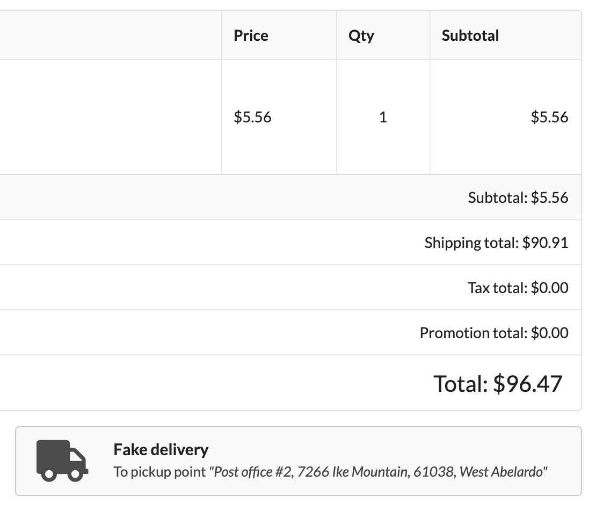

# Sylius Pickup Point Plugin

[![Latest Version][ico-version]][link-packagist]
[![Software License][ico-license]](LICENSE)
[![Build Status][ico-github-actions]][link-github-actions]

Add a `<select>` that contains pickup points to your shipping checkout step.

- [Screenshots](#screenshots)
- [Installation](#installation)


**Supported providers**
- DAO
- GLS
- PostNord
- Fake provider (for development/playing purposes — not enabled in `prod`)

## Compatibility

| Plugin | Sylius        | PHP    | Symfony            |
|--------|---------------|--------|--------------------|
| 2.x    | `^2.0`        | `>=8.2`| `^6.4 \|\| ^7.4`   |
| 1.x    | `^1.0`        | `>=8.1`| `^5.4 \|\| ^6.0`   |

Migrating from 1.x to 2.x: see [UPGRADE.md](UPGRADE.md).

## Screenshots

### Shop

This is the shipping method step in the checkout process where you can choose a pickup point.


On the complete order step in checkout you can see the pickup point you have chosen.



### Admin

On the order you can see what pickup point the customer has chosen.


When you edit shipping method you can associate a pickup point provider to that shipping method.


## Installation

### Step 1: Install and enable plugin

```bash
composer require setono/sylius-pickup-point-plugin
```

Add the bundle to your `config/bundles.php`:

```php
<?php
# config/bundles.php

return [
    // ...
    Setono\SyliusPickupPointPlugin\SetonoSyliusPickupPointPlugin::class => ['all' => true],
    // ...
];
```

### Step 2: Import routing

```yaml
# config/routes/setono_sylius_pickup_point.yaml
setono_sylius_pickup_point_plugin:
    resource: "@SetonoSyliusPickupPointPlugin/config/routes/shop.yaml"
```

### Step 3: Customize resources

**Shipment resource**

```php
<?php
// src/Entity/Shipment.php

declare(strict_types=1);

namespace App\Entity;

use Doctrine\ORM\Mapping as ORM;
use Setono\SyliusPickupPointPlugin\Model\PickupPointAwareTrait;
use Setono\SyliusPickupPointPlugin\Model\ShipmentInterface;
use Sylius\Component\Core\Model\Shipment as BaseShipment;

#[ORM\Entity]
#[ORM\Table(name: 'sylius_shipment')]
class Shipment extends BaseShipment implements ShipmentInterface
{
    use PickupPointAwareTrait;
}
```

**Shipping method resource**

```php
<?php
// src/Entity/ShippingMethod.php

declare(strict_types=1);

namespace App\Entity;

use Doctrine\ORM\Mapping as ORM;
use Setono\SyliusPickupPointPlugin\Model\PickupPointProviderAwareTrait;
use Setono\SyliusPickupPointPlugin\Model\ShippingMethodInterface;
use Sylius\Component\Core\Model\ShippingMethod as BaseShippingMethod;

#[ORM\Entity]
#[ORM\Table(name: 'sylius_shipping_method')]
class ShippingMethod extends BaseShippingMethod implements ShippingMethodInterface
{
    use PickupPointProviderAwareTrait;
}
```

You can read about extending resources [here](https://docs.sylius.com/customization/model).

**Update shipping resources config**

```yaml
# config/packages/_sylius.yaml
sylius_shipping:
    resources:
        shipment:
            classes:
                model: App\Entity\Shipment
        shipping_method:
            classes:
                model: App\Entity\ShippingMethod
```

### Step 4: Configure plugin

**Enable desired providers**

- `faker` will not work in the production environment
- Each carrier provider requires its corresponding bundle to be installed:
  - `dao` → `setono/dao-bundle`
  - `gls` → `setono/gls-webservice-bundle`
  - `post_nord` → `setono/post-nord-bundle`

The carrier bundles are listed in this plugin's `suggest` section — install only the ones you need.

```yaml
# config/packages/setono_sylius_pickup_point.yaml
setono_sylius_pickup_point:
    providers:
        faker: true
        gls: true
        post_nord: true
        dao: true
```

### Step 5: Database

```bash
bin/console doctrine:migrations:diff
bin/console doctrine:migrations:migrate
```

### Step 6: Validation groups

Add `checkout_select_shipping` to `sylius.form.type.checkout_select_shipping.validation_groups`:

```yaml
# config/packages/_sylius.yaml
parameters:
    sylius.form.type.checkout_select_shipping.validation_groups: ['sylius', 'checkout_select_shipping']
```

### Step 7: Install assets

```bash
bin/console assets:install
```

The plugin's JavaScript is auto-included on the admin and shop layouts via Twig
hooks (`sylius_admin.base#javascripts` / `sylius_shop.base#javascripts`).

### Step 8: Admin shipping method form

Add the `pickupPointProvider` field to your admin shipping-method form. With
Sylius 2.x's Twig hooks the cleanest path is a project-local hook config that
points at a template containing `{{ form_row(form.pickupPointProvider) }}`,
attached to `sylius_admin.shipping_method.update.content.form.options` (or a
form section you already render).

## Play

To see the pickup points list, use the following example address at checkout:

```
Dannebrogsgade 1
9000 Aalborg
DK
```

```
Hämeentie 1
00350 Helsinki
FI
```

```
Vasterhaninge 1
137 94 Stockholm
SE
```

Providers have pickup points in the following countries:

- **DAO**: DK
- **PostNord**: DK, SE, FI
- **GLS**: See https://gls-group.eu/EU/en/depot-parcelshop-search

So, to play with all 3 providers at once — use a `DK` address.

[ico-version]: https://poser.pugx.org/setono/sylius-pickup-point-plugin/v/stable
[ico-license]: https://poser.pugx.org/setono/sylius-pickup-point-plugin/license
[ico-github-actions]: https://github.com/Setono/SyliusPickupPointPlugin/workflows/build/badge.svg

[link-packagist]: https://packagist.org/packages/setono/sylius-pickup-point-plugin
[link-github-actions]: https://github.com/Setono/SyliusPickupPointPlugin/actions
